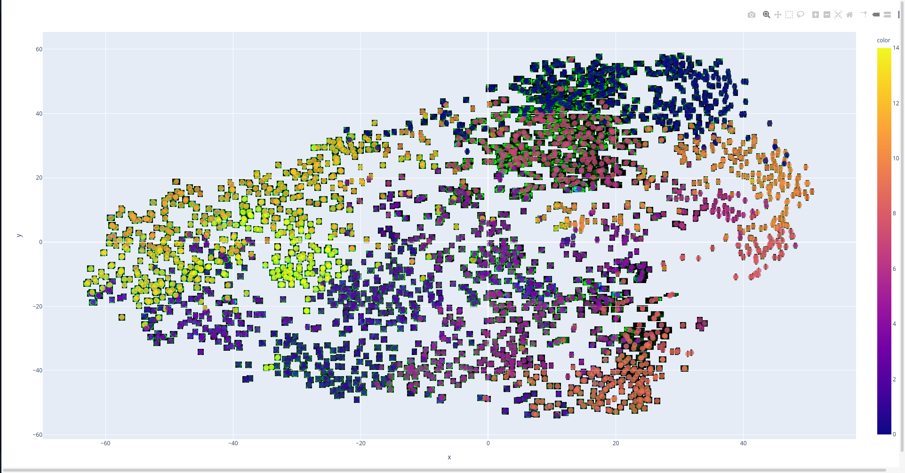
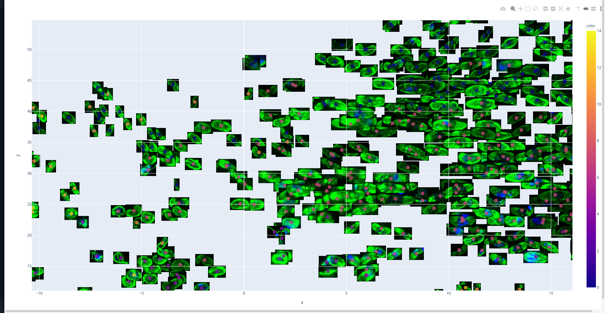
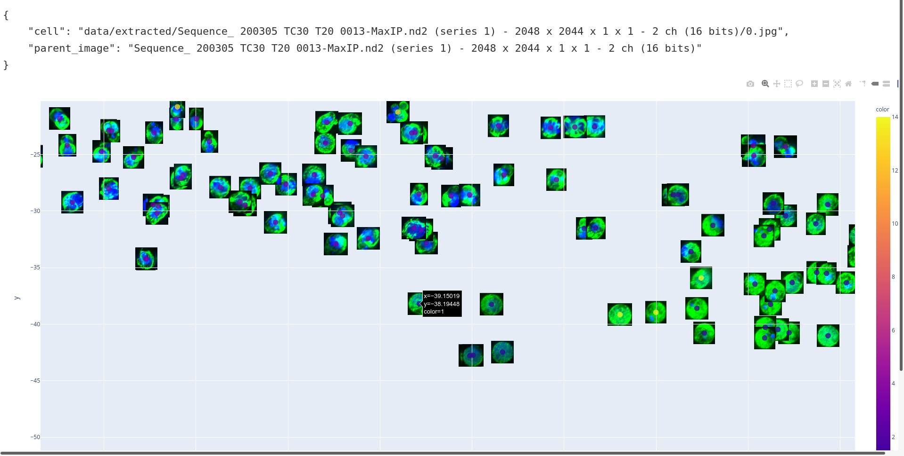
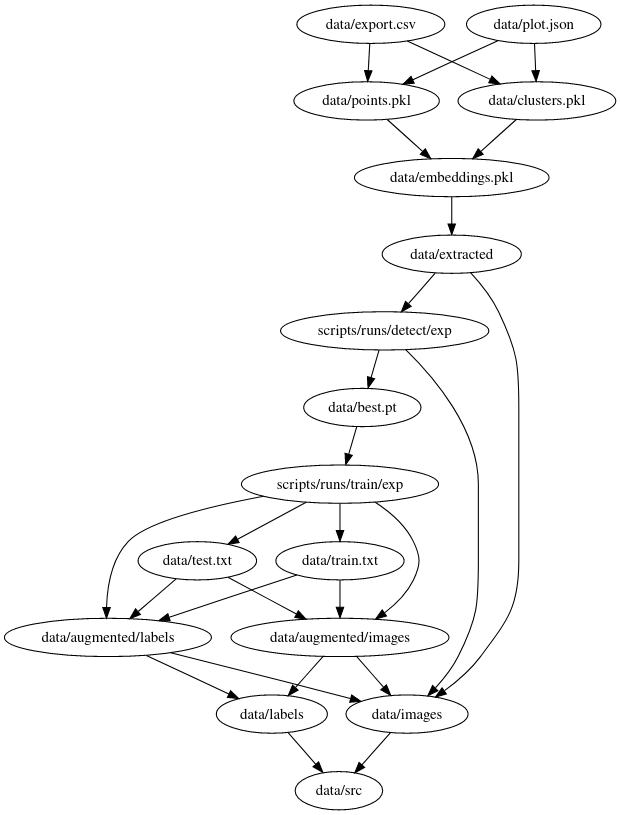
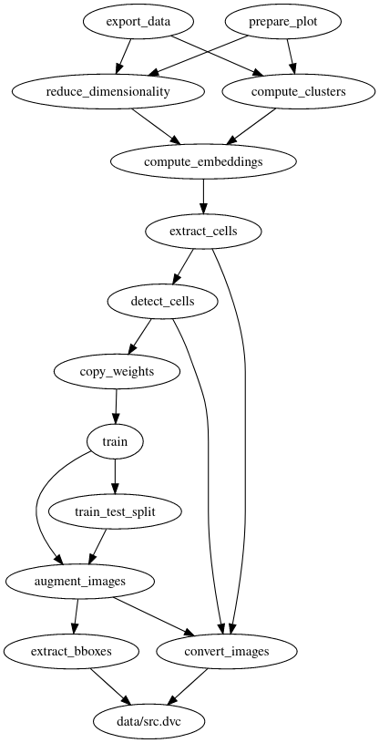

# Cell shape analysis

## Purpose

In microbiology, cell shape is a very informative data-point for determining the effectiveness of drugs for treating many conditions, such as malaria.

## Tools used

1. [Python3](https://www.python.org/about/) - general purpose scripted object-oriented programming language, with easy-to-understand syntax.
2. [DVC](https://dvc.org/) - Python library, that allows tracking of data and pipeline changes in a unified matter, works on top of Git and can be used with different data-storage backends (such as Google Cloud Storage) to improve reproducibility and simplify colaboration between ML researchers.
    > **IMPORTANT - READ ABOUT [STORAGE CONCERNS](#storage-concerns)**
3. [YOLOv5](https://github.com/ultralytics/yolov5) - Object Detection neural network, implemented in PyTorch, trained on data from lab images of cells. Used as a baseline for [transfer learning](https://en.wikipedia.org/wiki/Transfer_learning).
4. [EfficientNet](https://github.com/lukemelas/EfficientNet-PyTorch)-B1 - pre-trained Image Classification network, with the classification head being stripped-off, is used for embedding images of single cells, obtained from cell detection, into a 1000-dimensional feature space in order to improve the performance of clusterization and dimensionality reduction.
5. [K-Means](https://scikit-learn.org/stable/modules/clustering.html#k-means) - algorithm for unsupervised Clusterization, used with cell Embeddings
6. [t-SNE](https://scikit-learn.org/stable/modules/manifold.html#t-sne) - algorithm for unsupervised Dimensionality Reduction, allows to visualize 1000-dimensional embeddings on a 2D plot
7. [Plotly](https://plotly.com/) and [Dash](https://dash.plotly.com/) - Python libraries for visualization and development of interactive dashboards.
8. [Albumentations](https://albumentations.ai/docs/) for training dataset augmentation.
9.  [kneed](https://kneed.readthedocs.io) library for [Elbow Method](https://en.wikipedia.org/wiki/Elbow_method_(clustering)) for detecting the optimal number of clusters.

## How to run the pipeline

> Below steps have been verified on Debian/Ubuntu. In case you are working on Windows, it is **highly advised** to use virtual machine.

1. Install Miniconda 3.8 from the official [site](https://docs.conda.io/en/latest/miniconda.html).
2. [Clone](https://docs.github.com/en/github/creating-cloning-and-archiving-repositories/cloning-a-repository) or download the [repository](https://github.com/andriihomiak/malaria-research).
3. Run the following inside of the repository.
    ```bash
    conda activate
    python3 -m venv --clear venv
    conda deactivate
    . venv/bin/activate
    ```
4. Install python dependencies (in the same shell)
    ```
    pip install -r requirements.txt
    ```
5. [Install gsutil](https://cloud.google.com/storage/docs/gsutil_install) (Google Cloud command-line utility) and configure it using
    ```bash
    gcloud init
    gcloud auth application-default login
    ```
    This will ask you to click on a link and paste the auth code from the browser.
    > You need to login with **malaria.cv.research@gmail.com** credentials in order to have access to pipeline resources.
6. Download the pipeline (this will download source data from Google Cloud Storage as well as preprocessing, training and clustering results) - currently it will download **~21GB** of data (with 20GB being the original raw dataset size and 1GB - pipeline stage results).
   ```bash
   dvc config cache.type symlink # this will skip file copying after the initial download and will instead use symbolic links
   dvc pull # will do actual data downloading
   ```
7. Once data has been downloaded, make sure that the pipeline is ready
   ```
   dvc status
   ```
   should print
   ```
   Data and pipelines are up to date.
   ```
   In case the message is different (e.g. some files are missing or corrupted), run `dvc pull` again - it will download the missing data.
8. View the results by running
    ```
    python scripts/visualize_embeddings.py data/plot.json
    ```
    and opening http://127.0.0.1:8050 in your browser.
    The visualization is a 2D projection of 1000-dimensional cell embedding space, obtained via cell detection + embeddings + t-SNE dimensionality reduction. Colored dots on top of every image represent the clusters assigned to the cell by using KMeans on the 1000-dimensional feature vector.
    
    Use your mouse to zoom and move around the plot
    

    Clicking on a particular cell will show the cell image location as well as its parent image

    
    

    Read more on the visualization [here](#visualization)

## Pipeline structure

The pipeline is described via DVC - a data versioning system, that takes care of tracking data processing steps. This allows making a consistent and reproducible research environment as well as simplifying the iteration.

DVC pipeline consists of **stages** - operations on a dataset, that take some files as an input and produce some other files as output. They can be thought of as functions from input files to output files. Particular transformations can be any command, and in our case they are just invocations of Python scripts.

Stages are described in dvc.yaml file and look somewhat like this:
```
stages:
  convert_images:
    cmd: python scripts/convert_raw.py
      --input-folder data/src/
      --output-folder data/images/
      --output-format jpg
    deps:
      - scripts/convert_raw.py
      - data/src/
    outs:
      - data/images/
  extract_bboxes:
    cmd: python scripts/extract_yolov5_bboxes.py
      --input-folder data/src/
      --output-folder data/labels/
    deps:
      - scripts/extract_yolov5_bboxes.py
      - data/src/
    outs:
      - data/labels/
  ...
```
Steps have `cmd` section for the command, `deps` for the dependencies and `outs` for the outputs.

DVC knows that when the dependencies of one stage include the outputs of the other stage it means that there is a dependency. Such dependencies can be visualized.
Here is the visualization of the stage dependencies (arrow goes from the dependant to the dependency):



And here is a visualization of the file dependencies:



The dependencies are transitive, meaning that if dependencies of the `convert_images` stage change (conversion script or the raw data or script arguments) - this will cause the invalidation of all the steps that depend on `convert_images` - like `train`, `detect_cells` and all the way to the `prepare_plot`.

To reproduce the pipeline after code/data changes, run this command:
```
dvc repro
```

This will detect the changed stages and run them, along with their dependants.

> Read more about available commands on the [DVC doc](https://dvc.org/doc)

### Working with DVC

Suppose you want to make some changes to the pipeline. Below are the steps needed to perform certain scenarios.

#### Scenario 1: Visualize existing pipeline clusters

This scenario assumes that there is an existing ready pipeline (achieved by following the [How to run the pipeline](#how-to-run-the-pipeline) or [Scenario 2](#scenario-2-run-the-pipeline-with-updated-data-and-preserve-the-changes) and [Scenario 3](#scenario-3-edit-the-pipeline-code)).

The procedure is simple. 

1. Make sure that the virtual environment is active
```
. venv/bin/activate
```
2. Run the visualization server
```
python scripts/visualize_embeddings.py data/plot.json
```
3. Open http://127.0.0.1:8050 to see the visualization.

#### Scenario 2: Run the pipeline with updated data and preserve the changes

Let's say we want to update the souce data by adding new images to the `data/src/` folder.

First, we need to activate the virtual environment of our project:

```
. venv/bin/activate
```

Than we need to make sure that DVC is aware of our git branch changes:

```
dvc install
```

If you get an error like this:
```
ERROR: failed to install DVC Git hooks - Hook 'post-checkout' already exists. Please refer to <https://man.dvc.org/install> for more info.
```
it means that DVC is already aware of the git environment (that is OK).

Then we create and switch to a new git branch with the name `feature/add-more-awesome-data` (can be any string without spaces):

```
git checkout -b feature/add-more-awesome-data
```

After editing the contents of the `data/src/` folder, run the `dvc status` to see that DVC detected data changes:

```
convert_images:
        changed deps:
                modified:           data/src
extract_bboxes:
        changed deps:
                modified:           data/src
data/src.dvc:
        changed outs:
                modified:           data/src
```

Now lets rerun the entire pipeline with new data:
```
dvc repro
```
This command will run everything from the stage DAG (Directed Acyclic Graph) and generate new pipeline artifacts (new trained model, new plots etc.)

The end of the output of the command will look like this:
```
Running stage 'export_clusters' with command:
        python scripts/export_clusters_csv.py --clusters data/clusters.pkl --output-file data/clusters_export.csv
Updating lock file 'dvc.lock'                                         

To track the changes with git, run:

        git add dvc.lock data/src.dvc
Use `dvc push` to send your updates to remote storage.
```

At this stage you might want to [visualize the cell clusters](#visualization).

In case you want to add more data and continue this iteration, simply run `dvc repro` again after data changes.

> When the data has not been changed, the `dvc repro` will tell you that the data and pipelines are up to date and will not rerun the entirety of the computations.

Once you are happy with the outcome, commit the changes to the git repository (this will only track the metadata of the files, i.e. directory and file hashes):

```
git add .
git commit -m "Added new data. Results rock!"
```

Now the changes you've made by adding new data are tracked by git - but only locally. To make them available to other researchers that use the same repository, we need to push the changes to the remote (GitHub server in our case).
Also, new data (new source files, as well as stage outputs) has to be uploaded as well (currently DVC only knows where the data is located on your PC - we have to upload it to some remote location, like Google Cloud storage in our case).

Since we ran `dvc install` previously, DVC already keeps track of the git changes, and when we will push the repo changes to the GitHub, DVC will automatically push the data to the data remote (Google Cloud Storage in our case), to keep the data synchronized with the code that uses it. The procedure is simple:
```
git push -u origin feature/add-more-awesome-data
```
You will see that DVC is querying the remote data storage for its contents to decide which local files, created by the pipeline, are missing, and will then upload the only missing ones. After this the actual git push will be executed - your code will be pushed to the Github repository, and anyone who has access to the repo and data storage backend (refer to the [How to run the pipeline](#how-to-run-the-pipeline) step featuring `gcloud auth` command) will be able to get the exact same results as you did, when running `dvc repro`.

For others to view your pipeline results, they need to:
1. Activate the virtual environment
    ```
    . venv/bin/activate
    ```
2. Checkout to your branch
    ```
    git checkout feature/add-more-awesome-data
    ```
3. Download the pipeline data:
    ```
    dvc pull
    ```
4. Now they can visualize the clusters as described in the [Visualization](#visualization)


#### Scenario 3: Edit the pipeline code

Same as [Scenario 2](#scenario-2-run-the-pipeline-with-updated-data-and-preserve-the-changes), the only difference is that you will change code files inside of the `scripts/` folder. Then running `dvc repro` and pushing the data to the remote is identical to the Scenario 2, but this scenario requires Python proficiency, and is therefore omitted here.


### Stage descriptions

#### `data/src.dvc`

* This stage is just a source data, used for the entire pipeline. It has no dependencies, and is considered to be changed when the contents of the `data/src/` folder change.

* `data/src/` contains all source images in TIFF or .ND2 format, along with the `.xml` labels. The directory structure is flat (no subdirectories)

#### `extract_bboxes`

* This stage extracts bounding boxes (bboxes) by reading the contents of `data/src/` folder, matching the `.xml` files with `.nd2`/`.tif` images to compute YOLOv5 bboxes. They need to be presented in a form of `label_id x y w h`, where 
    * `label_id` is 0 in our case as we detect a single type of objects (`cell`)
    * `x` and `y` - normalized coordinates of the box center relative to the image with and height correspondingly
    * `w` and `h` - normalized box width and height as a fraction of image width/height
* It depends on the `data/src/` fodler for `.xml` files and raw images and `scripts/extract_yolov5_bboxes.py` script.
* It outputs the bboxes in YOLOv5 format to `data/labels/`

#### `convert_images`

* This stage converts images from raw format like `.nd2` or `.tif` to a more lightweight format (`.jpg`) and applies some color preprocessing:
  * Interprets the values of the channels as green and blue colors, leaving red with a value of 0
  * Maps the values from 16bit range to an 8bit range by:
    1. Computing per-channel quantiles for background and the highlights and scales the values to `[0, 1]` range (e.g. every pixel value for original channel that is below `0.95` percentile is cut-off to a value of 0 and every value that is above `0.9995` percentile is cut off at a value of 1)
    2. Multiples per-channel values by 255 to fit a 24-bit RGB  standart.
  * Converts the resulting image to JPEG format.
* It depends on the `data/src/` fodler for raw images and `scripts/convert_raw.py` script.
* It outputs the converted images to the `data/images/` fodler.
  
#### `augment_images`

* This stage uses bboxes and converted images to generate more training data by rotating and mirroring the images and bboxes and obtains **x8 dataset size increase**.
* It depends on the `data/images/` folder for converted images, `data/labels/` for YOLOv5 bboxes and `scripts/augment.py` script.
* It outputs the augmented images to the `data/augmented/images/` folder and the augmented bboxes to the `data/augmented/labels/`.

#### `train_test_split`

* This stage splits the data into train and test datasets, to be later used with training. This steps also makes sure that the images, genereated from the same original image are all bundled up in the same dataset - to minimize the risk of a data leak.
* It depends on `data/augmened/images/` and `data/augmented/labels/` folders and `scripts/train_test_split.py`
* It outputs the `data/train.txt` and `data/test.txt` files to be used later with training.
#### `train`
* This stage uses augmented data, split into `train` set for training and `test` set for validation and outputs the trained model. The model being trained is YOLOv5 and more information regarding it can be accessed on the [project's GitHub](https://github.com/ultralytics/yolov5).
  The gist of training procedure:
  * Images are checked for corruption
  * Pre-trained model weights are downloaded if missing
  * GPU is initialized (if available)
  * Data is split into mini-batches
  * Each batch is passed into the network, loss is computed and gradient descent is used to tune the model parameters
  * The training continues for a couple of epochs (15 currently)
    > Epoch is single pass of the entire dataset trough a model
  * During the training some model statistics as current loss, precision, recall and mAP scores on the `test` set are logged to stdout and to a file `scripts/runs/train/exp/results.txt`.
  * The resulting model weigths are stored in `scripts/runs/train/exp/weights/best.pt`.
* It depends on `data/augmented/images/`, `data/augmented/labels/`, `data/train.txt`, `data/test.txt` and `scripts/train.py`
* It outputs the `scripts/runs/train/exp/weights/best.pt` file with the model weights
  
#### `copy_weights`

* This stage simply copies the model weights to the `data/` folder to simplify model usage.
* It depends on `scripts/runs/train/exp/weights/best.pt` model weights file.
* It outputs `data/best.pt` model weights file.

#### `detect_cells`

* This stage uses the trained model to extract cells bboxes from the converted (but not augmented) images. This stage showcases the ability of the model to work with arbitrary converted images - they shouldn't be necessarily all labelled previously.
* It depends on the trained model weights `data/best.pt`, converted images `data/images/` and `scripts/detect.py`.
* It outputs the YOLOv5 bboxes for the images in the `scripts/runs/detect/exp/` folder.

#### `extract_cells`

* This stage uses detected cell bboxes and converted images to extract single cell images.
* It depends on converted images from `data/images/`, detected cell bboxes from `scripts/runs/detect/exp/` and `scripts/extract_cells.py`
* It outputs extracted cells in a following structure:
  ```
    data/
        extracted/
            image1/
                0.jpg
                1.jpg
            image2/
                0.jpg
            image3/
                0.jpg
                1.jpg
                2.jpg
            ...
  ```
  I.e. for every source image from `data/images/` a folder inside `data/extracted/` with the image name is created and every detected cell image is assigned a number starting from 0.

#### `compute_embeddings`

* This stage uses pre-trained EfficientNet model model to extract 1000-dimensional vector representations of the cell. The resulting embeddings are stored to be used for clustering and visualization later.
* It depends on extracted cells from `data/extracted/` and `scripts/compute_embeddings.py`
* It outputs the embeddings to `data/embeddings.pkl`

#### `reduce_dimensionality`

* This stage uses embeddings of the cell images and reduces the dimensionality from being 1000D to just 2D by using tSNE algorithm. Resulting 2D vectors for every cell are stored to be used when preparing the plots.
* It depends on embeddings `data/embeddings.pkl` and `scripts/reduce_dimensionality.py`.
* It outputs 2d points for every cell image to the `data/points.pkl`

#### `compute_clusters`

* This stage uses KMeans algorithm to clusterize the embeddings of the cell images. Automatic elbow method is used in order to select the optimal number of clusters. Resulting cluster assignmets for every cell are stored for use when preparing the plot.
* It depends on the `data/embeddings.pkl` and `scripts/compute_clusters.py`
* It outputs the assigned clusters to `data/clusters.pkl`

#### `export_data`

* This stage exports the clusters and points in the `.csv` format.
* It depends on the `data/clusters.pkl`, `data/points.pkl`, and `scripts/export_data_csv.py`
* It outputs the clusters and poits in CSV format to the `data/export.csv`

#### `prepare_plot`

* This is the final stage of the pipeline. It combines 2d points from dimensionality reduction with assigned clusters to prepare a 2d plot with cells and their clusters for the use by the researchers to analyse the cell shape implications.
* It depends on the 2d points `data/points.pkl` and cluster assignment from `data/clusters.pkl`
* It outputs a Plotly-readable plot description for later use with Dash.

### Visualization

Visualization web-app is a Python-based web application, that uses Plotly and Dash to visualize the 2D representation of 1000D embedding space of different cells, and helps to find images with similar shape among more than a 1000 cells, by grouping them together on the plot.

It can be viewed (provided that the pipeline is up-to-date and `data/plot.json` is present) in the following way:
```
python scripts/visualize_embeddings.py data/plot.json
```

### Storage concerns

DVC does not provide a specific storage solution for the data, and instead relies on the abundance of existing well-established data storage solutions.

This project uses Google Cloud Storage due to its low storage cost and no additional management requirements except a google cloud account with enbled billing, and also provides a free 90-day $300 trial.

> **The trial will end on May 18, 2021!**

Below is a cost estimation for common use-cases:

| Scenario                                                                    | Estimated cost | Cost explanaion                                                                                                                                                                 |
| --------------------------------------------------------------------------- | -------------- | -------------------------------------------------------------------------------------------------------------------------------------------------------------------------------- |
| Download the data with `dvc pull` (first time)                              | $2             | Source Dataset takes up ~21GB so main expense is network bandwidth when downloading                                                                                              |
| `dvc pull` after the new iteration (without changing source files)          | $0.1           | Since the largest files did not change, `dvc pull` will not download them; other pipeline arifacts (stage results) typically take less than 1GB when `convert_images` is changed |
| Upload (`dvc push`) a new iteration with changing source data (`data/src/`) | $0.1           | Upload is free, but DVC makes some Google Storage API calls to work properly                                                                                                     |
| Upload a new iteration without changing source data                         | $0.1           | Same as above                                                                                                                                                                    |
| Data storage fees for 1 month                                               | $0.5           | This is based of current storage usage of 60GB+                                                                                                                                  |

> Currently the price of Google Cloud Storage usage during entire development is $7.5 (pretty cheap). Billing report can be found [here](https://console.cloud.google.com/storage/browser/malaria-cv-research?authuser=3&project=northern-eon-305013).

> Currently the data is stored in the [`malaria-cv-research/dvc` GCS bucket](https://console.cloud.google.com/storage/browser/malaria-cv-research?authuser=3&project=northern-eon-305013&pageState=(%22StorageObjectListTable%22:(%22f%22:%22%255B%255D%22))&prefix=&forceOnObjectsSortingFiltering=false), with `malaria.cv.research@gmail.com` being the project owner account.
